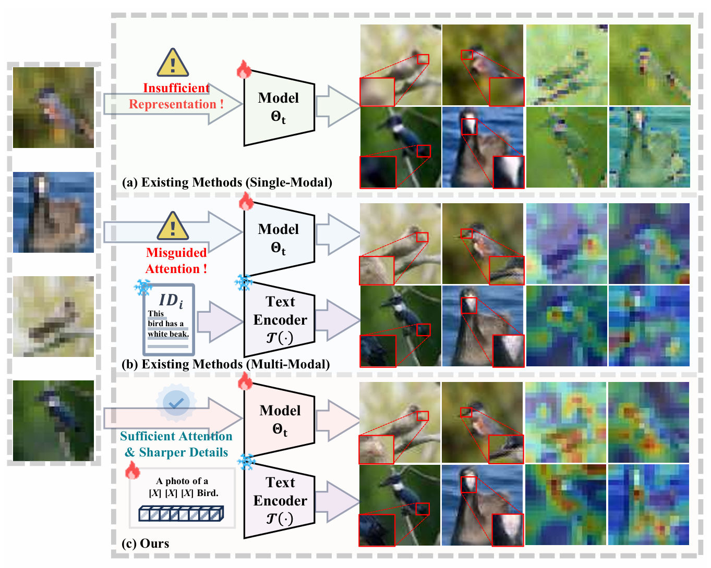
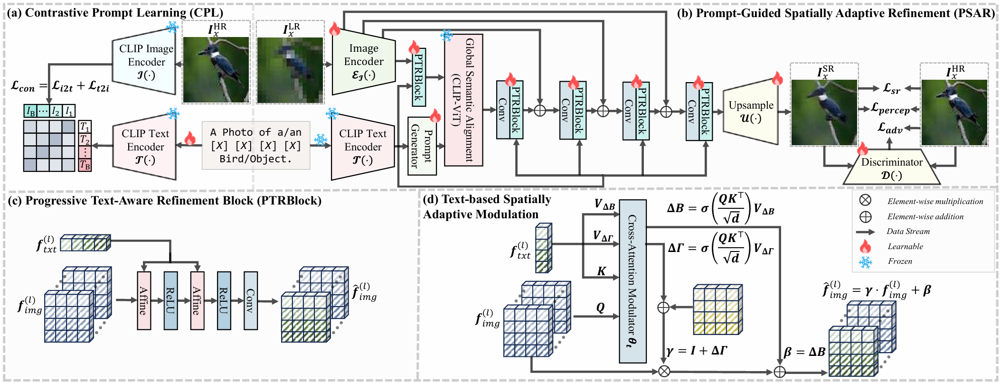

# Simon-SR: Spatially Adaptive Modulation and Visual Prompt Adaptation for Text-Reinforced Super-Resolution

  

  <strong>Haotong Cheng</strong>1*&emsp;
  <strong>Yuxuan Li</strong>1&emsp;
  <strong>Zijie Cui</strong>1&emsp;
  <strong>Rongling Tan</strong>1&emsp;
  <strong>Chenyuan Wang</strong>1

  1College of Electronic Science and Engineering, Jilin University &nbsp;

---

> Official implementation of **Simon-SR: Spatially Adaptive Modulation and Visual Prompt Adaptation for Text-Reinforced Super-Resolution**.

## Overview

Single Image Super-Resolution (SISR) aims to reconstruct a high-resolution image from a low-resolution observation. Although recent text-guided and multimodal approaches improve perceptual quality, their performance often depends heavily on manually written captions or descriptions generated by pretrained multimodal models.

These textual priors may contain incorrect or incomplete semantics, which can misguide the restoration model and introduce implausible details. In addition, preparing text annotations for large-scale super-resolution datasets introduces considerable annotation and computational costs.

To address these limitations, we propose **Simon-SR**, a multimodal super-resolution framework that treats textual semantics as learnable latent variables rather than fixed ground-truth descriptions.

Simon-SR consists of two main components:

- **Contrastive Prompt Learning (CPL):** learns instance-level textual prompts directly from unannotated images using frozen CLIP image and text encoders.
- **Prompt-Guided Spatially Adaptive Refinement (PSAR):** progressively injects the learned textual semantics into image features through spatially adaptive affine modulation.

The resulting framework improves text-image alignment while reducing sensitivity to erroneous textual priors.

## Acknowledgement

Our code is built upon [CLIP-SR](https://github.com/Bingwen-Hu/CLIP-SR)

## Contact

For questions, feel free to reach out at **chenght9923@mails.jlu.edu.cn**.

